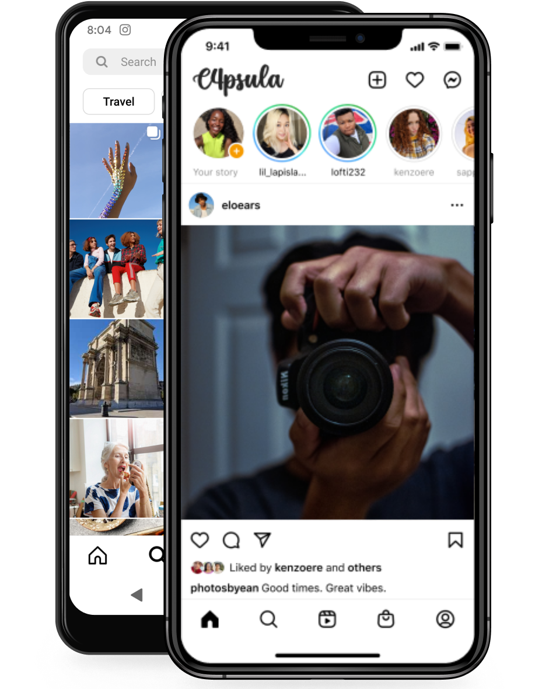

  

  

<h1 align="center">Sua nova rede social</h1>
A C4PSULA é uma rede social, onde os usuários podem compartilhar fotos e vídeos com seus seguidores. 

Inspirada no conceito do Instagram, essa plataforma oferece uma interface intuitiva e amigável, permitindo que os usuários criem perfis, sigam outras pessoas e interajam por meio de curtidas, comentários e compartilhamentos. 

Os usuários têm a liberdade de compartilhar momentos do seu dia a dia, como viagens, refeições, paisagens, eventos e muito mais. 

Além disso, a C4PSULA também oferece recursos de edição de fotos e filtros para personalizar as imagens antes de compartilhá-las. 

Com uma comunidade diversificada de usuários, essa plataforma proporciona uma experiência social envolvente, permitindo que as pessoas se conectem e descubram novas inspirações por meio de conteúdos visuais.

Copyright © 2023 <a href="https://github.com/C4PISTRANO"><B>C4PISTRANO</B></a>. Todos os direitos reservados.

